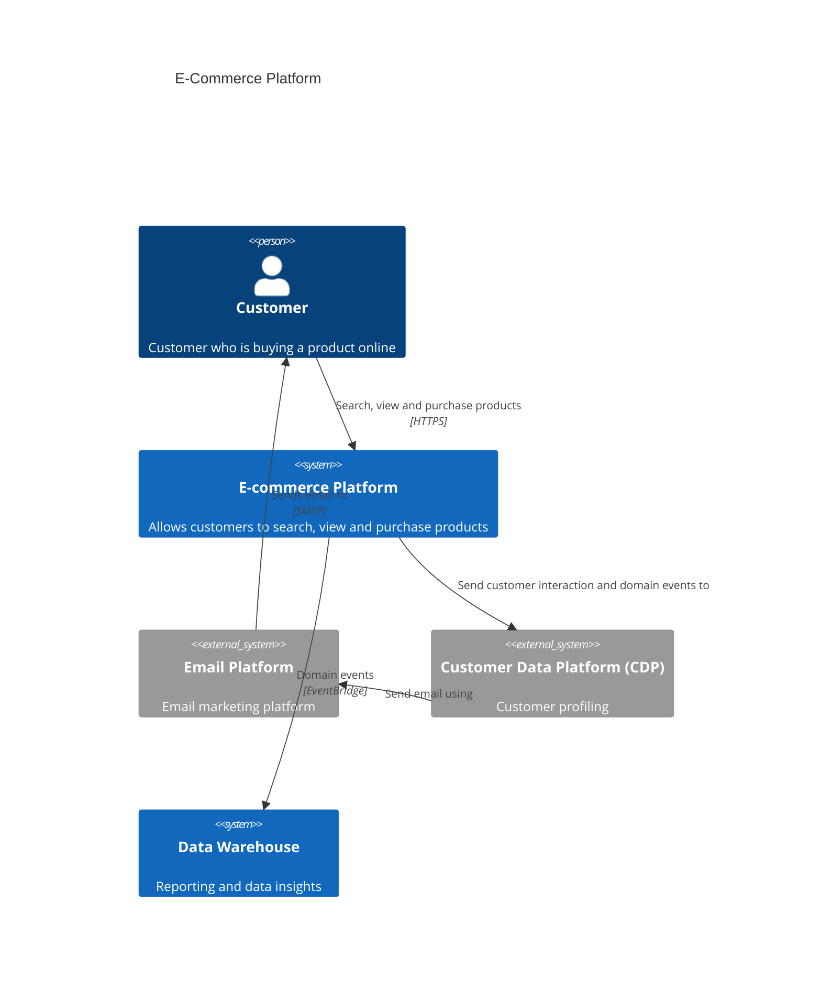
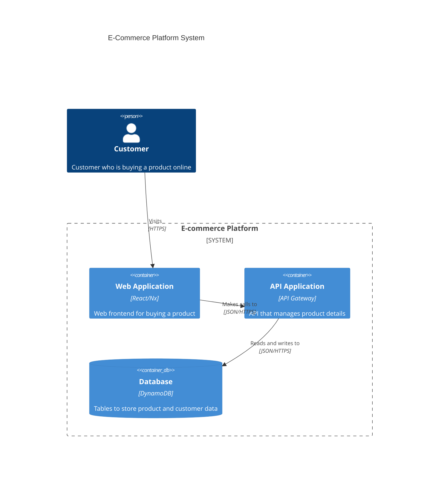
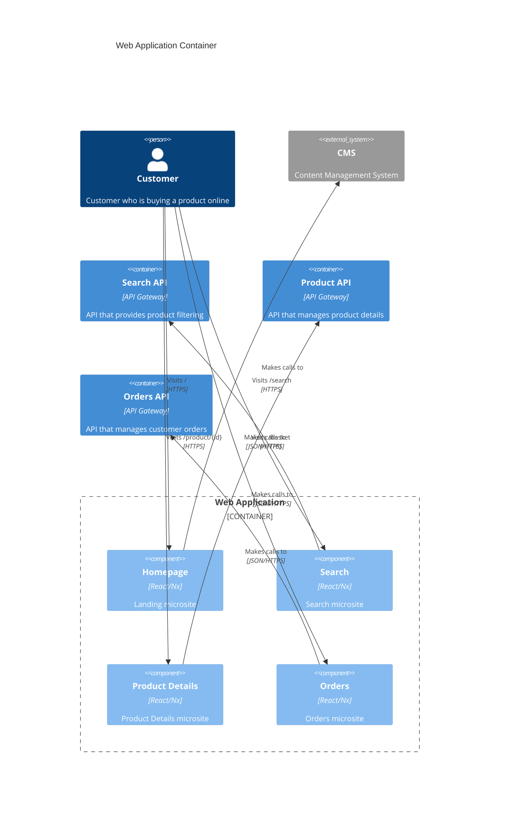
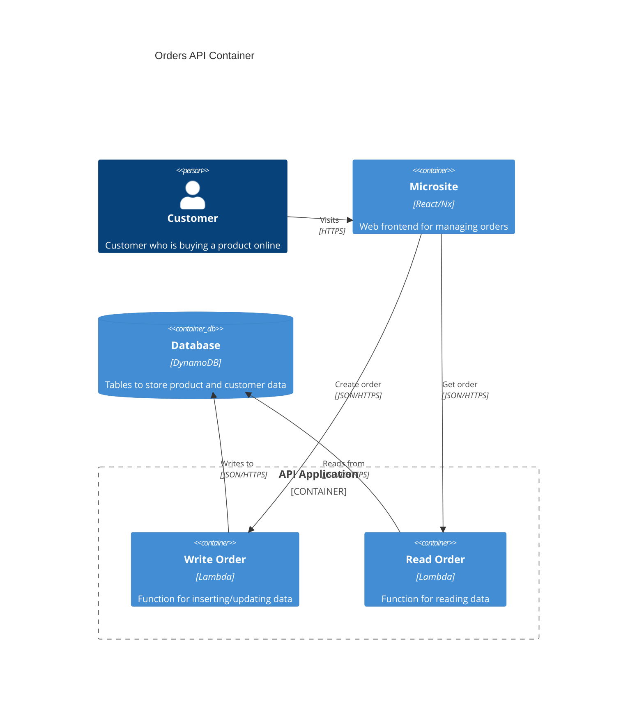

# E-Commerce Diagrams

## E-Commerce Platform Context Diagram

```mermaid
C4Context
    accTitle: E-Commerce Platform
    accDescr: E-Commerce Platform

    Person(person, "Customer", "Customer who is buying a product online")

    System(webApp, "E-commerce Platform", "Allows customers to search, view and purchase products")
    System_Ext(emailPlatform, "Email Platform", "Email marketing platform")
    System_Ext(cdp, "Customer Data Platform (CDP)", "Customer profiling")
    System(dwh, "Data Warehouse", "Reporting and data insights")

    Rel(person, webApp, "Search, view and purchase products", "HTTPS")
    Rel(webApp, cdp, "Send customer interaction and domain events to")
    Rel(cdp, emailPlatform, "Send email using")
    Rel(emailPlatform, person, "Sends email to", "SMTP")
    Rel(webApp, dwh, "Domain events", "EventBridge")
```

## E-Commerce Platform Container Diagram

```mermaid
C4Context
    accTitle: E-Commerce Platform System
    accDescr: E-Commerce Platform System

    Person(person, "Customer", "Customer who is buying a product online")

    System_Boundary(webApp, "E-commerce Platform", "Allows customers to search, view and purchase products") {
        Container(webApp, "Web Application", "React/Nx", "Web frontend for buying a product")
        Container(api, "API Application", "API Gateway", "API that manages product details")
        ContainerDb(db, "Database", "DynamoDB", "Tables to store product and customer data")

        Rel(webApp, api, "Makes calls to", "JSON/HTTPS")
        Rel(api, db, "Reads and writes to", "JSON/HTTPS")
    }

    Rel(person, webApp, "Visits", "HTTPS")
```

### Web Application Component Diagram

```mermaid
C4Context
    accTitle: Web Application Container
    accDescr: Web Application Container

    Person(person, "Customer", "Customer who is buying a product online")

    Container_Boundary(webApp, "Web Application", "") {
        Component(landingApp, "Homepage", "React/Nx", "Landing microsite")
        Component(searchApp, "Search", "React/Nx", "Search microsite")
        Component(productApp, "Product Details", "React/Nx", "Product Details microsite")
        Component(orderApp, "Orders", "React/Nx", "Orders microsite")
    }

    System_Ext(cms, "CMS", "Content Management System")
    Container(searchApi, "Search API", "API Gateway", "API that provides product filtering")
    Container(productApi, "Product API", "API Gateway", "API that manages product details")
    Container(orderApi, "Orders API", "API Gateway", "API that manages customer orders")

    Rel(person, landingApp, "Visits /", "HTTPS")
    Rel(landingApp, cms, "Makes calls to")
    Rel(person, searchApp, "Visits /search", "HTTPS")
    Rel(searchApp, searchApi, "Makes calls to", "JSON/HTTPS")
    Rel(person, productApp, "Visits /product/{id}", "HTTPS")
    Rel(productApp, productApi, "Makes calls to", "JSON/HTTPS")
    Rel(person, orderApp, "Visits /basket", "HTTPS")
    Rel(orderApp, orderApi, "Makes calls to", "JSON/HTTPS")
```

### Orders API Component Diagram

```mermaid
C4Context
    accTitle: Orders API Container
    accDescr: Orders API Container

    Person(person, "Customer", "Customer who is buying a product online")

    Container(webApp, "Microsite", "React/Nx", "Web frontend for managing orders")

    Container_Boundary(api, "API Application", "API Gateway that manages orders") {
        Container(writeLambda, "Write Order", "Lambda", "Function for inserting/updating data")
        Container(readLambda, "Read Order", "Lambda", "Function for reading data")
    }

    ContainerDb(db, "Database", "DynamoDB", "Tables to store product and customer data")

    Rel(person, webApp, "Visits", "HTTPS")
    Rel(webApp, writeLambda, "Create order", "JSON/HTTPS")
    Rel(writeLambda, db, "Writes to", "JSON/HTTPS")
    Rel(webApp, readLambda, "Get order", "JSON/HTTPS")
    Rel(readLambda, db, "Reads from", "JSON/HTTPS")
```